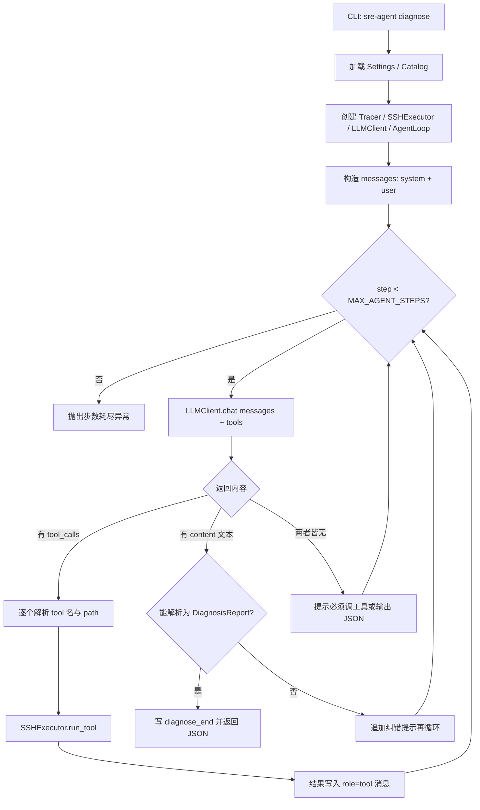

# sre-agent 代码实现逻辑说明

> 配合阅读：`操作手册.md`（怎么用）+ 本文（代码怎么跑）。  
> 目标：帮你建立「入口 → Agent 循环 → 安全层 → SSH → Trace」心智模型，便于自己改代码。

---

## 1. 一句话架构

本项目是一个 **Tool-calling Agent**：

1. LLM 根据症状决定调哪个「命名工具」  
2. 本地代码把工具名映射成**预置命令模板**（不是模型拼的任意 shell）  
3. 经白名单 / 审批 / 脱敏后，通过 SSH 在远程执行  
4. 把 stdout/stderr 塞回对话，继续下一轮，直到模型输出最终 JSON 报告  

核心安全思想：**模型只能选工具名和有限参数，不能直接拿到 shell。**

---

## 2. 分层视图（建议按这个顺序读源码）

```text
┌─────────────────────────────────────────────────────────┐
│  main.py（CLI 入口：ping / tool / diagnose）              │
└───────────────────────────┬─────────────────────────────┘
                            │
          ┌─────────────────┼─────────────────┐
          ▼                 ▼                 ▼
   config.py          agent/               tools/
   (.env/YAML)        loop/prompts/schema   ssh_exec/catalog
                            │                 │
                            ▼                 ▼
                         llm/client      safety/
                         (HTTP API)      allowlist/approval/sanitize
                                              │
                                              ▼
                                         远程 SSH 主机
                            │
                            ▼
                         obs/trace  →  traces/*.jsonl
```

三层对应转行故事里说的拆分：

| 层 | 目录 | 职责 |
|----|------|------|
| 策略层 | `agent/` + `llm/` | 怎么想、调什么工具、何时结束 |
| 工具层 | `tools/` | 怎么连主机、怎么真正执行 |
| 安全/观测层 | `safety/` + `obs/` | 能不能执行、审计记什么 |

以后做「企业 Agent 平台」，优先抽后两层；做 IDE Agent，换工具实现，循环骨架可复用。

---

## 3. 模块职责一览

| 文件 | 职责 | 关键符号 |
|------|------|----------|
| `main.py` | Typer CLI；组装依赖并 `asyncio.run` | `ping` / `tool` / `diagnose` |
| `config.py` | 读 `.env`、路径常量、加载 YAML | `Settings`、`load_hosts`、`load_tools_config` |
| `agent/loop.py` | Agent 主循环（本项目大脑） | `AgentLoop.run`、`tools_for_openai` |
| `agent/prompts.py` | 系统提示词与用户提示词 | `SYSTEM_PROMPT`、`user_prompt` |
| `agent/schema.py` | 最终报告的 Pydantic 结构 | `DiagnosisReport` |
| `llm/client.py` | 调 OpenAI 兼容 Chat Completions | `LLMClient.chat` |
| `tools/catalog.py` | 从 YAML 构建工具目录 | `get_catalog` |
| `tools/ssh_exec.py` | SSH 连接与执行 | `SSHExecutor.run_tool` / `ping` |
| `safety/allowlist.py` | 工具定义、渲染命令、禁词检查 | `build_catalog`、`render_command` |
| `safety/approval.py` | 需审批工具直接拒绝（v0） | `ApprovalGate.require` |
| `safety/sanitize.py` | 输出截断与敏感信息脱敏 | `truncate`、`redact` |
| `obs/trace.py` | JSONL 审计日志 | `Tracer.log` |
| `eval/run_eval.py` | 离线 fixture 评测 | `score_fixture_case` |

配置文件（不是 Python，但属于运行时契约）：

| 文件 | 契约 |
|------|------|
| `configs/hosts.yaml` | 允许连接的 host_id → IP/用户/跳板 |
| `configs/tools.yaml` | 允许调用的 tool_name → 命令模板 |

---

## 4. 总流程图（diagnose）



---

## 5. 三条 CLI 命令分别走哪条路径

### 5.1 `ping` —— 只验证 SSH

```text
main.ping
  → Settings + get_catalog()
  → SSHExecutor.ping(host_id)
      → _connect(host_id)
      → 执行固定命令: echo ok && hostname && whoami
      → 返回 stdout
```

**不经过** LLM、白名单工具渲染（命令写死在 `ping` 里）、完整 Agent 循环。  
用途：先确认网络/密钥/用户对不对。

### 5.2 `tool` —— 单工具联调

```text
main.tool
  → Tracer + SSHExecutor.run_tool(host, name, path)
      → catalog.get(name)          # 必须在白名单
      → ApprovalGate.require(...)
      → render_command(...)        # 模板化 + 禁词
      → SSH 执行 → redact/truncate
      → Tracer: tool_start / tool_end
```

**不经过** LLM。  
用途：验证某个诊断命令在目标机上的真实输出长什么样。

### 5.3 `diagnose` —— 完整 Agent

```text
main.diagnose
  → 组装 AgentLoop
  → AgentLoop.run(host, symptom)
      → 多轮 LLM ↔ 工具
      → DiagnosisReport
  → 打印 JSON + trace 路径
```

这是学习 Agent 工程时最该单步调试的路径。

---

## 6. Agent 循环详解（`agent/loop.py`）

### 6.1 启动时准备了什么

1. `messages` 初始两条：
   - `system`：`SYSTEM_PROMPT`（规则：只信工具结果、少调工具、结束时只出 JSON）
   - `user`：主机 ID + 症状文本
2. `tools = tools_for_openai(catalog)`：把本地 `ToolCatalog` 转成 OpenAI function calling 格式  
   - 有 `path_arg` 的工具，参数 `path` 被限制为 `enum: allowed_paths`  
   - **模型看不到真实 shell 字符串**，只看到工具名和描述

### 6.2 每一轮（一个 step）发生什么

```text
1. msg = await llm.chat(messages, tools)
2. 记录 tracer: llm_message
3. 分支：
   A. 若 msg.tool_calls 非空：
        - 把 assistant 消息 append 进 messages
        - 对每个 call：
            name = function.name
            path = json.loads(arguments).path   # 可能没有
            result = await executor.run_tool(...)
            messages.append({role: tool, tool_call_id, content: 结果JSON})
        - continue 下一轮
   B. 若 msg.content 非空：
        - 尝试 DiagnosisReport.from_llm_json(content)
        - 成功 → diagnose_end → return
        - 失败 → 追加“请只输出 JSON”再 continue
   C. 否则：提示“请调工具或输出报告”
4. 超过 max_agent_steps → RuntimeError
```

### 6.3 为什么错误也要回给模型

`run_tool` 失败时（未知工具、path 非法、SSH 失败等）不会直接让整个 diagnose 崩掉（在 loop 里 catch 了），而是：

```json
{"ok": false, "error": "..."}
```

这样模型可以换工具或结束并解释失败——这是 Agent 可靠性的基本写法。

### 6.4 和「传统脚本」的区别

| 传统排障脚本 | 本 Agent |
|--------------|----------|
| if/else 固定顺序查 df→du | LLM 动态决定下一步 |
| 输出给人看的文本 | 结构化 JSON + 证据列表 |
| 改逻辑改代码 | 可改 prompt/工具目录，但安全边界仍在代码里 |

---

## 7. 工具执行链路（`tools/ssh_exec.py` + `safety/`）

这是最重要的安全路径，建议对着源码逐步跟：

```mermaid
sequenceDiagram
  participant Loop as AgentLoop
  participant Exec as SSHExecutor
  participant Cat as ToolCatalog
  participant Gate as ApprovalGate
  participant AL as render_command
  participant SSH as Remote Host
  participant Tr as Tracer

  Loop->>Exec: run_tool(host_id, name, path)
  Exec->>Cat: get(name)
  Exec->>Gate: require(needs_approval)
  Exec->>AL: render_command(tool, path, allowed_paths)
  Exec->>Tr: tool_start
  Exec->>SSH: connect + run(command)
  SSH-->>Exec: stdout/stderr/exit
  Exec->>Exec: truncate + redact
  Exec->>Tr: tool_end
  Exec-->>Loop: ExecResult
```

### 7.1 `catalog.get(name)`

- 工具名必须存在于 `tools.yaml`  
- 否则 `KeyError: tool not allowlisted`  
- **即使模型胡编工具名也会在这里失败**

### 7.2 `ApprovalGate.require`

- `needs_approval=true` 的工具在 v0 **直接 PermissionError**，不会 SSH  
- 当前 `tools.yaml` 里全是 `false`（只读）  
- 以后加 `systemctl restart` 之类，应设 `needs_approval: true`，并改成「等人点批准」而不是直接 raise

### 7.3 `render_command`

关键点：

1. 若工具需要 `path`：必须提供，且 `path in allowed_paths`，path 本身不能含 `>`、`;`、`&&` 等  
2. 用 `tool.command.format(path=path)` 填模板（模板是人写死的，允许 `2>/dev/null`、管道、`||`）  
3. 再扫危险动词（`rm`/`dd`/`reboot` 等）以及 `$()`、反引号、换行、`;`  
4. **不要**因为模板里的 stderr 重定向 `>` 就拒绝整条命令（v0 曾误拦 `du_top` / `dmesg_tail` / `listen_ports`）

因此攻击面是：

- 模型只能影响：**选哪个工具名**、**选哪个允许的 path**  
- 不能：拼接 `rm -rf`、往 path 里塞 `>` 写文件（path 白名单 + 禁词；模板里的 `2>/dev/null` 是作者写死的，允许）

> 注意：`ping` 里的 `&&` 不走 `render_command`，是开发者写死的连通性探测。

### 7.4 SSH 连接

`_connect(host_id)`：

1. 只允许 `hosts.yaml` 里的 id  
2. 用 `.env` 的私钥  
3. 无 `jump`：直连  
4. 有 `jump`：先连跳板，再 `tunnel=` 连目标；tunnel 挂在 `conn._sre_tunnel`，关闭时一起关  
5. `known_hosts=None`：开发方便，**生产应改为严格校验**

`run_tool` 每次执行都是「连接 → 跑一条命令 → 关闭」，简单可靠，但高频时偏慢（后续可做连接池）。

### 7.5 输出处理

```text
stdout/stderr
  → truncate(max_output_bytes)   # 防撑爆上下文
  → redact(...)                  # 抹 password/token 等
  → 进入 ExecResult / Trace / 回传给 LLM
```

---

## 8. LLM 客户端（`llm/client.py`）

极简封装：

```text
POST {LLM_BASE_URL}/chat/completions
Authorization: Bearer {LLM_API_KEY}
body: { model, messages, temperature: 0.1, tools?, tool_choice: auto }
返回: choices[0].message
```

`message` 可能含：

- `content`：最终自然语言/JSON  
- `tool_calls`：要执行的函数列表  

任意 OpenAI 兼容网关只要实现同一协议即可替换。

`temperature=0.1`：诊断场景希望更稳、少胡编。

---

## 9. 配置如何灌进运行时（`config.py`）

```text
项目根 ROOT = src/sre_agent 的上两级
  ├── .env          → Settings（pydantic-settings）
  ├── configs/
  │     hosts.yaml  → load_hosts()
  │     tools.yaml  → load_tools_config() → build_catalog()
  └── traces/       → Tracer 输出目录
```

`Settings` 字段与环境变量别名对应，例如 `llm_api_key` ← `LLM_API_KEY`。

`get_catalog()`（`tools/catalog.py`）每次调用都会重新读 YAML——改工具配置后**不必重启安装**，下次命令即生效（已激活的同一进程除外；CLI 每次新进程所以一般立刻生效）。

---

## 10. 报告结构（`agent/schema.py`）

最终产物不是自由文本，而是 `DiagnosisReport`：

- `symptom` / `hypotheses` / `evidence` / `root_cause`
- `recommended_actions`（默认 `needs_approval=true`）
- `next_checks`
- `kernel_hint`（内核差异化字段；无则 `null`）

`from_llm_json` 会：

1. 去掉可能的 \`\`\` 代码围栏  
2. `json.loads`  
3. `model_validate`（字段类型不对会失败，触发 loop 里的纠错重试）

这样保证下游（展示、评测、工单系统）吃到的是稳定 schema。

---

## 11. Trace 观测（`obs/trace.py`）

每次创建 `Tracer()` 生成 `run_id` 与文件 `traces/<run_id>.jsonl`。

典型事件序列（diagnose）：

```text
diagnose_start
llm_message          # 可能多条
tool_start / tool_end  # 每次工具
llm_message
...
diagnose_end         # 含完整 report
```

学习建议：跑一次 diagnose 后，**按时间顺序读 jsonl**，比只看最终 JSON 更能理解 Agent 决策过程。

---

## 12. 评测逻辑（`eval/run_eval.py`）

当前 `--fixture` 是**离线契约检查**，还不跑真 LLM/SSH：

```text
case.json
  must_call_tools: ["df_h"]
  expected_root_cause_keywords: ["log", "/var", ...]
        │
        ▼
fixture/<id>.json   # 假装这些工具被调用过，带假 stdout
        │
        ▼
检查：
  1) fixture 是否覆盖 must_call_tools
  2) 假输出文本是否命中任一关键词
```

含义：先固定「这类故障至少该看哪些工具、输出里该有什么信号」。  
后续可扩展为：用 fixture 劫持 `SSHExecutor`，真跑 `AgentLoop` 做回归（直播评测）。

---

## 13. 建议的源码阅读顺序（1～2 小时）

1. `main.py` —— 看三条命令如何组装对象  
2. `agent/loop.py` —— 盯住 `run()` 的 for 循环三分支  
3. `tools/ssh_exec.py` 的 `run_tool` —— 执行主路径  
4. `safety/allowlist.py` 的 `render_command` —— 安全边界  
5. `llm/client.py` —— 请求长什么样  
6. `agent/prompts.py` + `schema.py` —— 模型被如何约束输出  
7. 实际跑一次 `diagnose`，对照 `traces/*.jsonl`  

动手改代码的小练习（由易到难）：

1. 在 `tools.yaml` 加一个只读工具（如 `uname_a`），跑 `tool` 验证  
2. 改 `SYSTEM_PROMPT`，要求报告必须包含 `confidence` 字段，并扩展 `DiagnosisReport`  
3. 给 `ApprovalGate` 做成交互式 y/N（为自动修复铺路）  
4. 给 `SSHExecutor` 加简单连接复用  

---

## 14. 数据流小结（一张表）

| 数据 | 产生位置 | 流向 |
|------|----------|------|
| symptom / host_id | CLI 参数 | → AgentLoop → prompt |
| tools schema | tools.yaml → catalog → tools_for_openai | → LLM |
| tool_call | LLM 返回 | → run_tool |
| command 字符串 | render_command | → SSH |
| stdout/stderr | 远程主机 | → sanitize → LLM messages + Trace |
| DiagnosisReport | LLM content 解析 | → CLI 打印 + Trace |

---

## 15. 当前实现的边界（学习时心里有数）

**已有**

- 白名单工具调用循环  
- SSH（含跳板）  
- Trace  
- 结构化报告  
- 离线 fixture 评测骨架  

**刻意未做（留给你迭代）**

- 写操作的人机审批 UI  
- 真机/真模型端到端自动评测  
- 连接池、并发多主机  
- 严格 `known_hosts`  
- FastAPI HTTP 服务（`pyproject` 里预留了可选依赖）  
- 多 Agent / 长期记忆  

理解上述边界后，你改代码时不会误以为「缺了就是 bug」。

---

## 16. 和操作手册的分工

| 文档 | 看什么 |
|------|--------|
| `操作手册.md` | 怎么安装、配置、跑命令、排错 |
| `代码实现逻辑说明.md`（本文） | 模块职责、调用链、为何这样设计 |
| `README.md` | 入口索引 |

读代码时：左手本文流程图，右手 IDE 跳转到对应文件即可。
